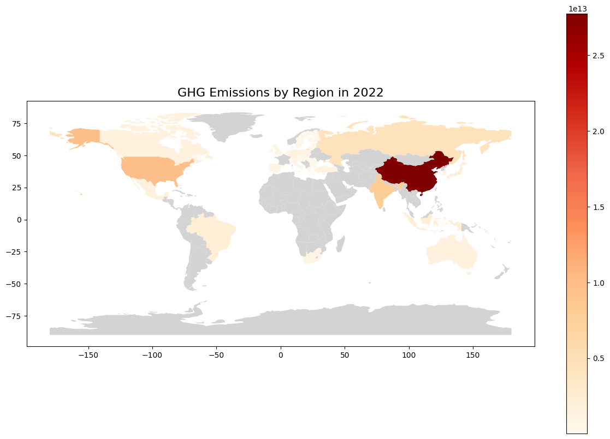
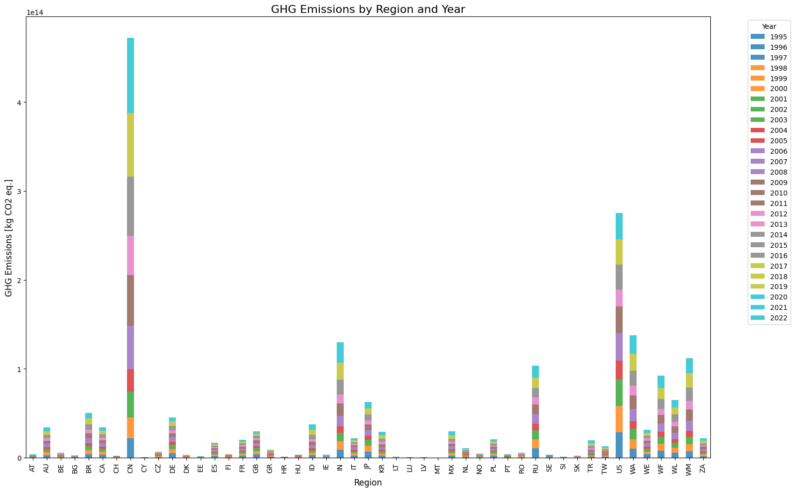
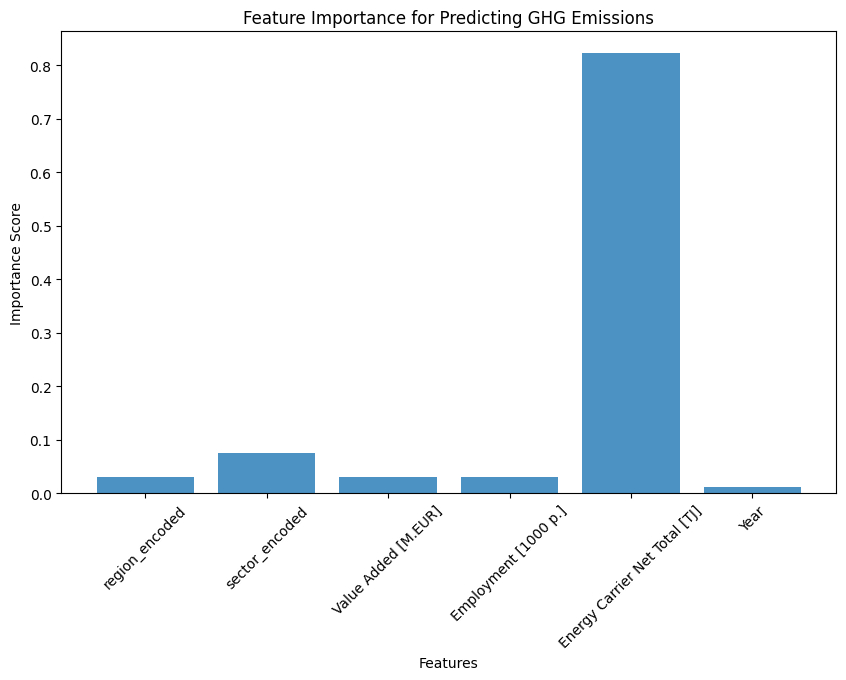
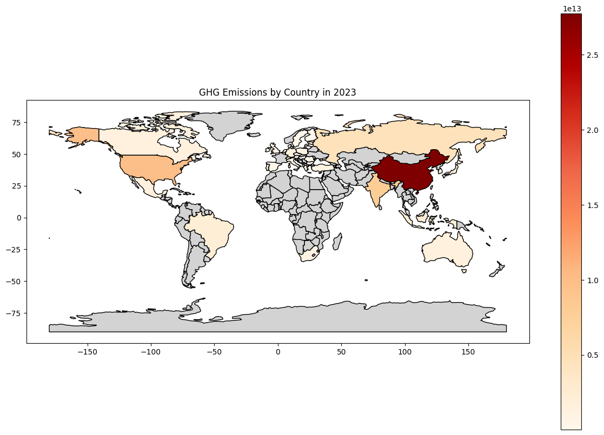

## My Project

My project focuses on analyzing and predicting greenhouse gas (GHG) emissions using a combination of exploratory data analysis (EDA), machine learning (ML), and neural networks. This work integrates environmental and economic datasets to gain insights into regional emissions, identify key influencing factors, and predict future emissions trends.

***

## Introduction 

Greenhouse gas emissions have become one of the most pressing issues of our time, contributing significantly to global warming and climate change. Understanding and predicting these emissions are critical for developing effective policies and strategies to combat climate change.

The problem is that emissions data are often complex, involving numerous regions, sectors, and influencing economic factors. Traditional methods struggle to capture these relationships effectively.

To address this issue, we use machine learning to analyze and predict emissions. The dataset includes detailed regional and sectoral data, making supervised learning the most suitable approach for this task. By leveraging advanced ML models, we aim to:
1. Identify key factors driving emissions.
2. Predict emissions trends and hotspots for future periods.

We analyzed the data, trained predictive models, and concluded that ML can effectively identify emissions drivers and provide accurate forecasts. This work highlights the potential for machine learning in climate action planning.

## Data

The dataset used in this project combines environmental and economic data, merging information from two sources:
1. **ExioML_factor_accounting_IxI.csv**
2. **ExioML_factor_accounting_PxP.csv**

These datasets provide:
- Regional and sectoral identifiers.
- Economic indicators such as value-added contributions and energy usage.
- Historical greenhouse gas emissions data.

### Data Preprocessing
- Missing values were imputed using mean or most frequent values, depending on the feature type.
- Categorical features (`region` and `sector`) were label-encoded.
- Numerical features (e.g., `GHG emissions`, `Value Added`) were normalized to ensure compatibility with machine learning models.


***

## Modelling

### Machine Learning Approach
We chose supervised learning methods to predict emissions. Key approaches included:
1. **Random Forest Regressor**: For baseline predictions and feature importance analysis.
2. **LightGBM**: For efficient, high-performance modeling with categorical and numerical data.
3. **LSTM Neural Networks**: To predict future emissions using temporal trends.

The models optimize for mean squared error (MSE), providing a quantitative measure of performance. Below is an example code snippet used for the Random Forest model:

```python
from sklearn.ensemble import RandomForestRegressor
from sklearn.model_selection import train_test_split
from sklearn.preprocessing import StandardScaler
import matplotlib.pyplot as plt
import pandas as pd

# 1. Feature and target value
features = ['region_encoded', 'sector_encoded', 'Value Added [M.EUR]', 
            'Employment [1000 p.]', 'Energy Carrier Net Total [TJ]', 'Year']
target = 'GHG emissions [kg CO2 eq.]'

X = merged_df[features]
y = merged_df[target]

# 2. Data segmentation (training set and test set)
X_train, X_test, y_train, y_test = train_test_split(X, y, test_size=0.2, random_state=42)

# 3. Feature standardization
scaler = StandardScaler()
X_train_scaled = scaler.fit_transform(X_train)
X_test_scaled = scaler.transform(X_test)

# 4. Train the random forest model
model = RandomForestRegressor(random_state=42, n_estimators=100)
model.fit(X_train_scaled, y_train)

# 5. Importance of extracting features
feature_importances = model.feature_importances_

# 6. Importance of visual features
plt.figure(figsize=(10, 6))
plt.bar(features, feature_importances, alpha=0.8)
plt.xlabel('Features')
plt.ylabel('Importance Score')
plt.title('Feature Importance for Predicting GHG Emissions')
plt.xticks(rotation=45)
plt.show()

## Modelling

In addition to this, I have trained the LSTM time series analysis model and then predicted the GHG emission in different regions of the world in 2023 and visualized the result

Here are some more details about the machine learning approach, and why this was deemed appropriate for the dataset. 

# 1. Data preprocessing
features = ['region_encoded', 'sector_encoded', 'Value Added [M.EUR]', 
            'Employment [1000 p.]', 'Energy Carrier Net Total [TJ]']
target = 'GHG emissions [kg CO2 eq.]'

# Group and sort by region and sector
merged_df = merged_df.sort_values(by=['region_encoded', 'sector_encoded', 'Year'])

# Normalized features
scaler = MinMaxScaler()
merged_df[features + [target]] = scaler.fit_transform(merged_df[features + [target]])

# Create time series data
def create_sequences(data, seq_length):
    X, y = [], []
    for i in range(len(data) - seq_length):
        X.append(data[i:i+seq_length, :-1])  
        y.append(data[i+seq_length, -1])    
    return np.array(X), np.array(y)

seq_length = 5  
grouped = merged_df.groupby(['region_encoded', 'sector_encoded'])

X, y = [], []
for _, group in grouped:
    group_values = group[features + [target]].values
    X_seq, y_seq = create_sequences(group_values, seq_length)
    X.extend(X_seq)
    y.extend(y_seq)

X = np.array(X)
y = np.array(y)


X_train, X_test, y_train, y_test = train_test_split(X, y, test_size=0.2, random_state=42)

# 2. Build the LSTM model
model = Sequential([
    LSTM(64, activation='relu', input_shape=(seq_length, X.shape[2]), return_sequences=True),
    Dropout(0.2),
    LSTM(32, activation='relu'),
    Dropout(0.2),
    Dense(1)  
])

model.compile(optimizer='adam', loss='mse', metrics=['mae'])
model.summary()

# 3. Train the model
history = model.fit(X_train, y_train, validation_data=(X_test, y_test), epochs=1, batch_size=32)

# 4. Evaluation model
loss, mae = model.evaluate(X_test, y_test)
print(f"Test Loss: {loss}, Test MAE: {mae}")

```

This is how the method was developed.

##Model Development
Data was split into training and testing sets to evaluate performance.
Hyperparameters were tuned to optimize model performance.
Feature importance analysis revealed that regional identifiers and economic indicators were the most significant drivers of emissions.

## Results
Figure 1 shows the GHG Emissions by Region in 2022 to help us with a basic understanding how it is nowadays.
Figure 1: GHG Emissions by Region in 2022

Figure 2 shows GHG Emissions by Region and Sector in 2022 to visualize how the seector could take account for the GHG Emission
Figure 2: GHG Emissions by Region and Sector in 2022

Figure 3 shows GHG Emissions by Region and Year to get the information of each regionn's contribution and the year contribution
Figure 3：GHG Emission by Region and Year

Figure 4 shows the features importance for predicting GHG emissions
Figure 4: Feature Importance for Predicting GHG Emissions

Figure 5 shows the GHG emissions by region, as predicted by our models.
Figure 5: Predicted GHG emissions by region in 2023.

Key results include:
High-emission regions were accurately identified.
Temporal trends showed a decrease in emissions for certain regions while others exhibited growth.
Models achieved competitive MSE scores, with LightGBM outperforming other approaches.

## Discussion

From Figure 1, we can observe that certain regions contribute disproportionately to emissions. The feature importance analysis highlighted that energy usage significantly impact emissions. Than the sector is the second factor influencing the GHG emissions.
The results demonstrate the utility of machine learning in identifying patterns and predicting future emissions. However, limitations include:
Dependence on data quality: Missing or inaccurate data can affect model reliability.
Temporal generalization: LSTM predictions are sensitive to historical trends and require careful tuning.

## Conclusion

From this work, the following conclusions can be made:
Machine learning effectively identifies key drivers of GHG emissions.
Predictive models like LightGBM and LSTM can forecast emissions trends accurately.
Visualization techniques provide actionable insights for policymakers.

